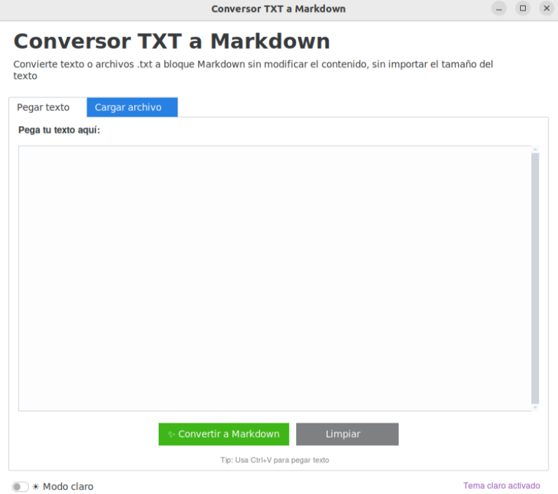

# 🚀 TXT to Markdown Converter

[](https://github.com/Juank9113/txt-to-md-converter/stargazers)
[](https://github.com/Juank9113/txt-to-md-converter/network/members)

Aplicación con interfaz gráfica moderna (estilo iOS) que convierte cualquier texto o archivo `.txt` en un **bloque de código Markdown** (` ```markdown ... ``` `) **sin modificar ni una línea del contenido original**.

Ideal para:
- 📚 Documentación técnica
- 💻 Ejemplos de código
- 📝 Publicaciones en foros que usan Markdown
- 🔒 Evitar que las IA o editores truncen bloques de código

---

## ✨ Características principales

| Característica | Descripción |
|----------------|-------------|
| 🖱️ **Dos modos de entrada** | Pegar texto directamente o cargar un archivo `.txt` |
| 🎨 **Interfaz moderna** | Tema oscuro/claro (por defecto oscuro) con `ttkbootstrap` |
| 🔒 **Conversión sin pérdidas** | Respeta espacios, saltos de línea, caracteres especiales |
| 💾 **Guardado como `.md`** | Archivo listo para GitHub, GitLab, cualquier plataforma |

---

## 📖 ¿Cómo empezar?

1. **Instalación** – Sigue la [guía de instalación](installation.md) (solo un comando).
2. **Uso** – Mira los [ejemplos prácticos](usage.md) (dos modos muy intuitivos).
3. **Problemas** – Consulta la [sección de solución de problemas](troubleshooting.md).

---

## 🧪 Vista previa (captura de pantalla)



> *Puedes añadir una captura real subiendo una imagen a `docs/img/screenshot.png`.*

---

## ⭐ ¡Apoya el proyecto!

Si este software te ha sido útil, **por favor, considera dejar una estrella 🌟 en GitHub**. Eso me ayuda a seguir mejorándolo y llegando a más personas.

[Haz clic aquí para ir a GitHub y dar una estrella](https://github.com/Juank9113/txt-to-md-converter)

---

## 👨‍💻 Autor

**Juan Carlos Blanco Ruiz**  
- GitHub: [@Juank9113](https://github.com/Juank9113)  
- Email: [juancarlosblancoruiz@gmail.com](mailto:juancarlosblancoruiz@gmail.com)

---

*Documentación construida con ❤️ y MkDocs.*