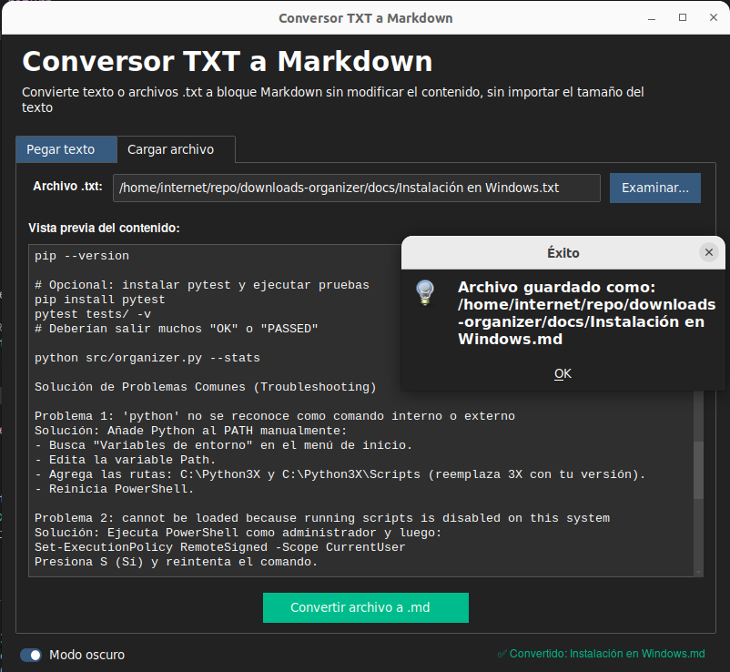

### 📄 `docs/usage.md` (cómo usar la GUI - fácil y visual)
---
# 🎮 Uso de la GUI (interfaz gráfica)

La aplicación tiene **dos pestañas** muy intuitivas. Cualquier persona, sin importar su nivel técnico, puede usarla.

---

## 🧾 Pestaña "Pegar texto" (modo rápido)

1. Abre la pestaña **📝 Pegar texto**.
2. **Copia** cualquier texto (desde un correo, documento web, código, etc.).
3. **Pégalo** dentro del área grande.
4. Haz clic en el botón **"Convertir texto pegado a .md"**.
5. Elige la ubicación y el nombre del archivo `.md` de salida.
6. ¡Listo! El archivo generado contiene el mismo texto, pero rodeado por ````markdown` y ````.

**Ejemplo:**

| Lo que pegas | Lo que se guarda |
|--------------|------------------|
| `# Hola mundo`<br>`Esto es una prueba.` | ````markdown`<br>`# Hola mundo`<br>`Esto es una prueba.`<br>```` |

---

## 📂 Pestaña "Cargar archivo" (para documentos largos)

1. Abre la pestaña **📂 Cargar archivo**.
2. Haz clic en **"Examinar..."** y selecciona un archivo `.txt` (puede ser cualquier archivo de texto, incluso sin extensión).
3. Verás el contenido del archivo en la vista previa.
4. Haz clic en **"Convertir archivo a .md"**.
5. El archivo `.md` se guarda **automáticamente** en la misma carpeta que el original, con el mismo nombre pero extensión `.md`.

> 💡 **Consejo**: Si tu archivo se llama `notas.txt`, el resultado será `notas.md` en la misma ruta.

---

## 🖼️ Imagen de referencia



*(Imagen de la ventala principal de la GUI)*

---

## ⚠️ Notas importantes

- **No se modifica el archivo original** – Siempre se crea uno nuevo.
- **El texto pegado o cargado se respeta al 100%** – No se añaden ni quitan espacios, saltos de línea o caracteres especiales.
- **Puedes convertir archivos muy grandes** – Solo depende de la memoria de tu computadora.

---

## ⭐ ¿Te gustó la herramienta? ¡Regálanos una estrella!

[Haz clic aquí para ir a GitHub y dar ⭐](https://github.com/Juank9113/txt-to-md-converter)

---

## 👤 Autor

**Juan Carlos Blanco Ruiz** – [@Juank9113](https://github.com/Juank9113) – juancarlosblancoruiz@gmail.com